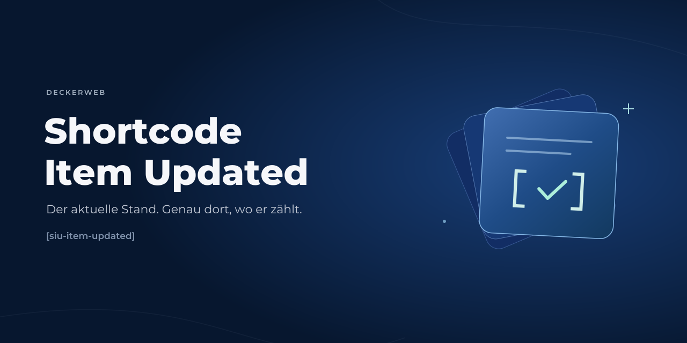

# Shortcode Item Updated



[English](README.md) · [Anleitung](docs/USER-GUIDE-de.md) · [Fragen nach Themen](docs/FAQ-de.md)

Zeige das Aktualisierungsdatum eines ausgewählten Beitrags, einer Seite oder eines Custom-Post-Type-Eintrags überall dort, wo WordPress-Shortcodes ausgeführt werden. Eine Download-Seite kann den Stand eines separaten Download-Eintrags zeigen; eine Dokumentübersicht den jüngsten Stand mehrerer Inhalte.

**Version 2.3.0** · WordPress **6.7+** · Plugin: PHP **8.0+** · Eigenständiges Snippet: PHP **7.4+**

[Auf einen Blick](#auf-einen-blick) · [Installation](#installation) · [Beispiele](#beispiele) · [Parameter](#shortcode-parameter) · [FAQ](#faq) · [Änderungsverlauf](#änderungsverlauf)

## Auf einen Blick

- Ein Shortcode: `[siu-item-updated]`.
- Ein bestimmter Eintrag, der aktuelle Loop-Eintrag oder der jüngste Stand einer festen ID-Liste.
- Optionaler Mindestabstand, relative Angaben, semantisches time-Markup und Text ohne Hüllelement.
- Datums-/Zeitformat der Website, eigene Beschriftungen und wiederverwendbare CSS-Klassen.
- Keine Einstellungsseite, automatische Einblendung oder Frontend-Skripte.
- Installierbares Plugin mit deckerweb Updater 2.1.0 und Library 0.8.1; zusätzlich ein eigenständiges Snippet.

## Installation

Lade das für Version 2.3.0 bereitgestellte installierbare ZIP herunter. Unter **Plugins → Installieren → Plugin hochladen** hochladen und aktivieren. Für den Shortcode sind keine Einstellungen nötig.

Für ein Update von 2.2.0 sichere Deine Website und installiere das ZIP als Ersatz. Das Plugin benötigt jetzt PHP 8.0. Shortcode-Name, bestehende Parameter und Filter bleiben erhalten; beachte die [Umstellungshinweise](docs/USER-GUIDE-de.md#umstellung-von-220).

Für die Snippet-Alternative gibt es [Anweisungen je Manager](docs/SNIPPETS-de.md). Das PHP-Snippet überall ausführen lassen. Aktiviere nicht beide Ausgaben gleichzeitig.

## Beispiele

Alle IDs sind Beispiele. Ersetze sie durch IDs Deiner Website. Die gezeigten Ergebnisse setzen beispielhaft eine gespeicherte Änderung am 3. Juni 2020 um 12:34 Uhr in der Zeitzone der Website voraus.

### Aktueller Artikel

Innerhalb eines eindeutigen Beitrags-Loops genügt:

```text
[siu-item-updated show_label="yes"]
```

Datumsformat der Website und Beschriftung in der Seitensprache werden automatisch verwendet. Bei `d.m.Y` lautet das Ergebnis: **Zuletzt aktualisiert: 03.06.2020**.

### Download-Stand auf einer anderen Seite

Die Inhaltsseite und der Download-Eintrag haben unterschiedliche IDs. Gib die ID des Download-Eintrags ausdrücklich an:

```text
[siu-item-updated post_id="123" date_format="de" show_label="yes" label_before="Download aktualisiert:"]
```

Ergebnis: **Download aktualisiert: 03.06.2020**. Gemeint ist der Änderungszeitpunkt des WordPress-Eintrags, nicht der Dateizeitstempel der hochgeladenen Datei.

### Jüngster Stand einer Dokumentübersicht

```text
[siu-item-updated post_ids="123,456,789" date_format="de" show_label="yes" label_before="Dokumente aktualisiert:"]
```

Es erscheint genau ein Datum: der jüngste Änderungszeitpunkt der gültigen öffentlich sichtbaren Quellen. Fehlende oder nicht verfügbare Einträge werden übersprungen. Eine fehlerhafte Liste bleibt ohne Ausgabe.

### Nur Änderungen mindestens einen Tag nach Veröffentlichung anzeigen

```text
[siu-item-updated post_id="123" only_if_updated="yes" min_update_gap="86400" show_label="yes"]
```

Die Anzeige bleibt verborgen, wenn der Eintrag nur bei Veröffentlichung oder innerhalb des ersten Tages gespeichert wurde. Verglichen werden Zeitpunkte; die inhaltliche Bedeutung einer Änderung wird nicht bewertet.

### Datum und deutsche Uhrzeit

```text
[siu-item-updated post_id="123" date_format="de" show_time="yes" time_format="H:i" show_sep="yes" sep=", um" label_after="Uhr" show_label="yes"]
```

Ergebnis: **Zuletzt aktualisiert: 03.06.2020, um 12:34 Uhr**.

### Relative Angabe

```text
[siu-item-updated post_id="123" display="relative" show_label="yes"]
```

Beispiel: **Zuletzt aktualisiert: vor 3 Tagen**. Relative Angaben werden beim erneuten Rendern der Seite berechnet; ein laufender Browser-Timer ist nicht enthalten.

### Semantisches Markup oder reiner Text

```text
[siu-item-updated post_id="123" semantic="yes" class="download-date muted"]
[siu-item-updated post_id="123" output="text" date_format="iso"]
```

Die erste Variante erzeugt ein `<time datetime="…">` innerhalb der gewohnten Hülle. Die zweite liefert ein Datum ohne Hüllelement, etwa **2020-06-03**. Das sind zwei getrennte Beispiele. Semantisches Markup fügt kein JSON-LD ein und verspricht keine bessere Suchmaschinenplatzierung.

## Shortcode-Parameter

Boolesche Parameter akzeptieren `yes` oder `no`; das historische deutsche `ja` schaltet ebenfalls ein. Unbekannte Werte wirken wie `no`. Die Standardwerte erhalten die einfache absolute Datumsanzeige.

| Parameter | Standard | Bedeutung |
| --- | --- | --- |
| `post_id` | Aktueller Loop-Eintrag | Positive ID eines öffentlichen Beitrags, einer Seite oder eines Custom-Post-Type-Eintrags. Außerhalb eines eindeutigen Beitrags-Loops ausdrücklich angeben. |
| `post_ids` | Leer | Kommagetrennte Liste mit höchstens 100 positiven IDs. Hat Vorrang vor post_id. Der jüngste zulässige Änderungszeitpunkt gewinnt. Doppelte IDs werden entfernt. |
| `date_format` | Datumsformat der Website | PHP-Datumsformat. Kürzel: de = d.m.Y; us und iso = Y-m-d. Das historische us-Kürzel ist ein ISO-artiges Format, kein Monat/Tag/Jahr-Format. |
| `time_format` | Zeitformat der Website | PHP-Zeitformat, etwa H:i oder g:i a. Wird nur bei absoluter Uhrzeit verwendet. |
| `show_date` | yes | Absolutes Datum anzeigen. Im relativen Modus muss show_date oder show_time eingeschaltet bleiben. |
| `show_time` | no | Absolute Uhrzeit anzeigen. Im relativen Modus wird die Datum/Uhrzeit-Kombination durch eine Zeitspanne ersetzt. |
| `show_sep` | no | sep nur einfügen, wenn absolutes Datum und Uhrzeit gemeinsam sichtbar sind. |
| `sep` | Geschütztes Leerzeichen + @; Deutsch: , um | Trenntext. HTML-Entities werden aufgelöst und für HTML-Ausgabe sicher maskiert. |
| `show_label` | no | label_before vor Datum/Uhrzeit oder relativer Zeitspanne anzeigen. |
| `label_before` | Zuletzt aktualisiert: | Textbeschriftung in der Sprache der dargestellten Seite. Ein ausdrücklicher Wert ersetzt den Standard. |
| `label_after` | Leer | Text nach der absoluten Uhrzeit, etwa Uhr. Ohne show_time und im relativen Modus ohne Wirkung. |
| `class` | Leer | Zusätzliche CSS-Klassen, durch Leerzeichen getrennt. item-last-updated bleibt erhalten. Nur im HTML-Modus. |
| `wrapper` | span | Erlaubtes HTML-Hüllelement. Nicht unterstützte Werte fallen auf span zurück. time erhält automatisch datetime. Nur im HTML-Modus. |
| `only_if_updated` | no | Änderung muss nach der Veröffentlichung liegen. Wird vor der Auswahl des jüngsten Datums je Quelle geprüft. |
| `min_update_gap` | 0 | Mindestabstand zwischen Veröffentlichung und Änderung in ganzen Sekunden; 86400 = ein Tag. Genau erreichte Schwelle genügt. Wirkt mit only_if_updated=yes. |
| `semantic` | no | Sichtbares Datum/Zeitspanne in time mit ISO-8601-datetime samt Zeitzonenoffset der Website ausgeben. Nur im HTML-Modus. |
| `output` | html | html liefert maskiertes Markup; text liefert Text ohne Hüllelement. In PHP-Templates Text passend zum Zielkontext maskieren. |
| `display` | absolute | absolute verwendet Datum/Uhrzeit der Quelle; relative zeigt eine Zeitspanne, etwa vor 3 Tagen. Zukünftige Zeitpunkte erscheinen als in 3 Tagen. |

Alle Kombinationen, erlaubten Hüllelemente, Cache-Hinweise und PHP-/Filterbeispiele stehen in der [ausführlichen Anleitung](docs/USER-GUIDE-de.md).

## FAQ

### Welche Inhalte kann ich verwenden?

Veröffentlichte, öffentlich sichtbare Beiträge, Seiten und Custom-Post-Type-Einträge ohne Passwort. Entwürfe, private Inhalte, Revisionen, gelöschte Beiträge und nicht öffentliche Beitragstypen werden für alle übersprungen, auch für Administratoren.

### Welches Datum wird angezeigt?

Der in WordPress gespeicherte Änderungszeitpunkt, formatiert in der Zeitzone der Website. Das Plugin verfolgt keine Änderungen an einer hochgeladenen PDF-Datei, prüft keine externen Dateien und unterscheidet keine redaktionellen Änderungen von gewöhnlichem Speichern.

### Wie verweise ich auf einen anderen Eintrag?

Mit `post_id="123"` oder mit `post_ids="123,456,789"` für den jüngsten zulässigen Stand. Ersetze die Beispiel-IDs durch IDs Deiner Website. Außerhalb eines Beitrags-Loops immer eine Quelle angeben.

### Warum wird nichts angezeigt?

Prüfe ID, öffentliche Sichtbarkeit, Änderungszeitpunkt sowie `only_if_updated` und den Mindestabstand. Fehlerhafte ID-Listen und ungültige Schwellenwerte bleiben ohne Ausgabe. Sind Datum und Uhrzeit beide ausgeschaltet, erscheint ebenfalls nichts.

### Funktioniert das mit meinem Builder?

Verwende das Shortcode-Element des Builders oder ein Feld, das WordPress-Shortcodes tatsächlich ausführt. Ein Feld, das den Shortcode als gewöhnlichen Text behandelt, rendert ihn nicht. Im Block-Editor genügt der vorhandene Shortcode-Block; dieses Plugin ergänzt keinen Gutenberg-Block.

### Kann ich stattdessen das Snippet verwenden?

Ja. Es bietet dieselben Shortcode-Funktionen und unterstützt PHP 7.4. Verwende genau eine Installationsart. Das eigenständige Snippet enthält keine dateibasierte Library, keinen Plugin-Updater und keine Übersetzungskataloge; Updates erfolgen manuell.

### Warum wirken relative Angaben oder Daten anderer Einträge veraltet?

Seitencaches speichern die fertig gerenderte Ausgabe. Relative Angaben altern, und die Änderung eines referenzierten Eintrags leert nicht zwingend den Cache der anzeigenden Seite. Leere deren Cache oder nutze die Abhängigkeits-/Ausnahmefunktionen Deines Caches. Absolute Ausgabe bleibt der Standard.

[Vollständige Fragen nach Themen](docs/FAQ-de.md).


## Änderungsverlauf

### 2.3.0 — 2026-10-08

- **Neu:** Bedingte Aktualisierungsanzeige mit Mindestabstand.
- **Neu:** Jüngster Aktualisierungsstand aus mehreren ausdrücklich angegebenen Beitrags-IDs.
- **Neu:** Semantisches time-Markup, Textausgabe ohne Hüllelement und relative Datumsanzeige.
- **Verbessert:** Dokumentierte Anwendungsfälle, vollständige Parameterübersicht und eigenständige Snippet-Ausgaben.
- **Verbessert:** Beschriftungen in der Seitensprache, einzelne CSS-Klassen und geprüfte HTML-Hüllelemente.
- **Behoben:** Die Kürzel de/us zeigen jetzt das Änderungsdatum der Quelle.
- **Behoben:** Standardbeschriftung wiederhergestellt; ungültige oder nicht verfügbare Quellen bleiben ohne Ausgabe.
- **Behoben:** Korrekte Website-Zeitzone sowie passende Trennzeichen und Uhrzeitzusätze.
- **Sonstiges:** deckerweb Updater 2.1.0 und Library 0.8.1 eingebunden.
- **Sonstiges:** Das Plugin benötigt PHP 8.0; das eigenständige Snippet unterstützt weiterhin PHP 7.4.

### 2.2.0 — 2025-03-28

- **Verbessert:** Klassenbasierte Shortcode-Implementierung.
- **Sonstiges:** Plugin-Metadatenlinks, Snippet-Download und aktualisierte deutsche Übersetzungen.

### 2.1.0 — 2025-03-15

- **Neu:** Deutsche Standardbeschriftungen ohne separate Übersetzungsdateien.
- **Verbessert:** Alternative Verwendung in PHP-Snippet-Managern.

### 2.0.0 — 2025-03-14

- **Verbessert:** Das schlanke Shortcode-Plugin aktualisiert.
- **Sonstiges:** Veraltete Shortcake-Integration entfernt; Übersetzungen und Versionsnummerierung aktualisiert.

### 2016-08-19 — 2016-08-19

- **Verbessert:** Dokumentation, Übersetzungen und Ausgabebehandlung.

### 2016-08-12 — 2016-08-12

- **Neu:** Deutsche und ISO-artige Datumskürzel sowie Shortcake-Integration.
- **Verbessert:** Übersetzungen und Kompatibilität mit WordPress 4.6.

### 2015-05-26 — 2015-05-26

- **Neu:** Optionale Beschriftungen, übersetzte Trennzeichen und aktueller Loop-Beitrag als Standard.
- **Behoben:** Variable im Übersetzungslader.
- **Verbessert:** Shortcode-Parameter und Installationsdokumentation.

[Vollständige Veröffentlichungshistorie](docs/CHANGELOG-de.md).

## Über das Projekt

2015 von David Decker erstellt, um den Stand eines Download-Eintrags auf einer separaten Inhaltsseite anzuzeigen. Das Plugin bleibt ein kleines Werkzeug für die Ausgabe. Minor-Versionen ergänzen kompatible optionale Funktionen; Patch-Versionen korrigieren Fehler. Inkompatible Änderungen werden ausdrücklich beschrieben.

## Probleme, Sicherheit und Unterstützung

Normale Probleme gehören in die [Issues](https://github.com/deckerweb/shortcode-item-updated/issues). Sicherheitsdetails bitte vertraulich über **Security → Report a vulnerability** im Repository melden; siehe [Sicherheitsrichtlinie](SECURITY-de.md).

Unterstütze die Pflege: [Ko-fi](https://ko-fi.com/deckerweb), [Buy Me a Coffee](https://buymeacoffee.com/daveshine), [PayPal](https://paypal.me/deckerweb).

## Lizenz und Komponenten

Copyright © 2015–2026 David Decker – DECKERWEB. GPL-2.0-or-later. Der mitgelieferte deckerweb Updater 2.1.0 und die Library 0.8.1 stammen von David Decker und stehen unter GPL-2.0-or-later. Komponentenquellen: [Updater](https://github.com/deckerweb/deckerweb-updater), [Library](https://github.com/deckerweb/deckerweb-plugin-library). Enthalten sind lokale Komponenten-Assets und Sprachressourcen. Kein Code aus Premium-Plugins wird mitgeliefert.

Der Shortcode baut keine externen Verbindungen auf. Der Updater kontaktiert GitHub für Update-Metadaten und Paketdownloads. Der Online-Katalog der Library ist optional und anfangs ausgeschaltet; Installation und Aktivierung erfordern bewusste Nutzeraktionen. Es gibt keine Telemetrie. Das Snippet baut keine externen Verbindungen auf. Siehe [Daten und Lebenszyklus](docs/DATA-de.md).

Die Grafiken stammen aus der freigegebenen, originären Vektorgestaltung. Die WordPress-Banner verwenden dieselben Elemente wie das GitHub-Banner und beschneiden ausschließlich oben und unten. SVGs enthalten native Formen, Schriftpfade und Farbverläufe, keine Rasterbilder, Filter oder externen Ressourcen. Die PNGs werden direkt aus denselben SVG-Quellen gerendert. Die Schrift Montserrat steht unter SIL Open Font License 1.1; siehe [Schriftlizenz](assets/FONT-LICENSE.txt).
